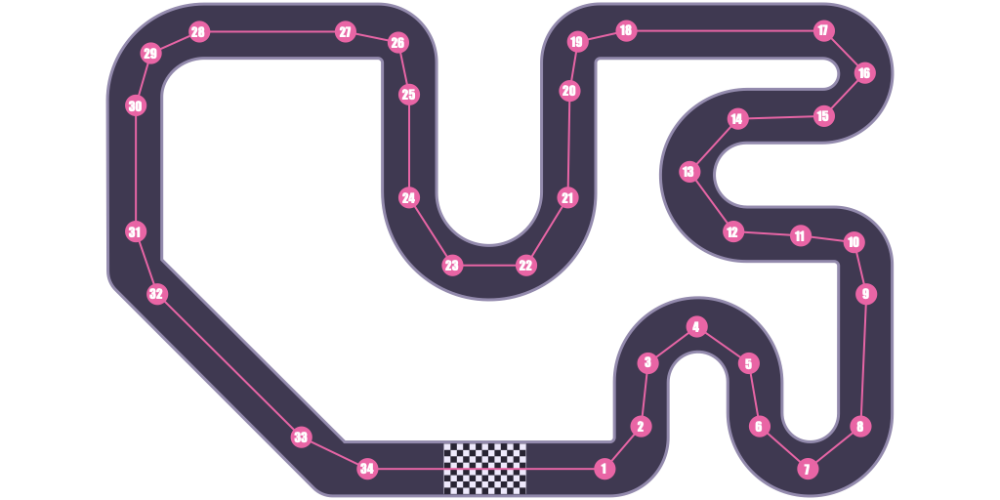

# Movement Plan for Pathfinder

> This document describes `v1` of the "movement plan" schema for Pathfinder.

## Table of Contents

<!-- TOC -->
* [Movement Plan for Pathfinder](#movement-plan-for-pathfinder)
  * [Table of Contents](#table-of-contents)
  * [Definition](#definition)
    * [Movement Plan](#movement-plan)
    * [Movement Step](#movement-step)
      * [Angle](#angle)
      * [Direction](#direction)
      * [Distance](#distance)
  * [Track Map](#track-map)
    * [Map Legend](#map-legend)
  * [Example Movement Plan](#example-movement-plan)
<!-- TOC -->

## Definition

A _movement plan_ represents the sequence of steps that Pathfinder will follow to navigate a track.

This section defines the structure of a movement plan and its child items.

### Movement Plan

Each movement plan consists of `n` number of steps.

* `n` is defined as `>= 1` and `<= 50`, for a maximum possible total of 50 steps.

### Movement Step

Each movement step consists of three child items.

#### Angle

The `angle` value represents the heading of the next movement.

* This value is expressed in degrees.
* The acceptable range for this value is `>= -360` and `<= 360`.

> [!IMPORTANT]
> The `angle` value is _always_ relative to the device's current heading.

#### Direction

The `direction` value represents the direction of the next movement.

* This value is expressed as a string.
* The acceptable options are `forward` and `backward`.

#### Distance

The `distance` value represents the distance of the next movement.

* This value is expressed in centimeters.
* The acceptable range for this value is `>= 1` and `<= 100`.

## Track Map



This track map visualizes a movement plan that starts and ends in the same position (bottom, center)

The track starts and ends in the checkered area (bottom center of the image).

The full movement plan consists of 34 steps and runs counter-clockwise.

### Map Legend

* The checkered area (bottom center) represents the starting and ending position.
* The track is represented by the dark thick line.
* Dots represent a single movement step.
* Lines represent a single movement path.

## Example Movement Plan

This section provides an example of a movement plan that represents 10 of the 34 steps in the track map.

**Step 1**

* angle: `0`
* direction: `forward`
* distance: `50`

```hcl
step {
  angle     = 0
  direction = "forward"
  distance  = "50"
}
```

**Step 2**

* angle: `-25`
* direction: `forward`
* distance: `10`

```hcl
step {
  angle     = -25
  direction = "forward"
  distance  = "10"
}
```

**Step 3**

* angle: `-20`
* direction: `forward`
* distance: `10`

```hcl
step {
  angle     = -20
  direction = "forward"
  distance  = "10"
}
```
